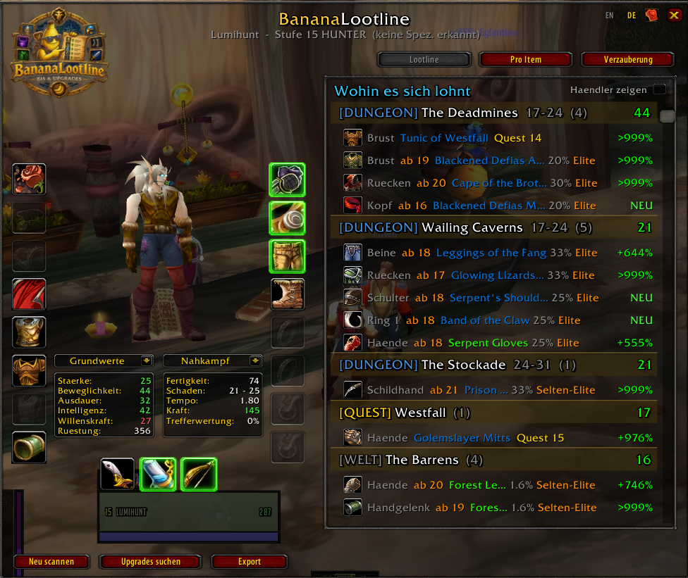
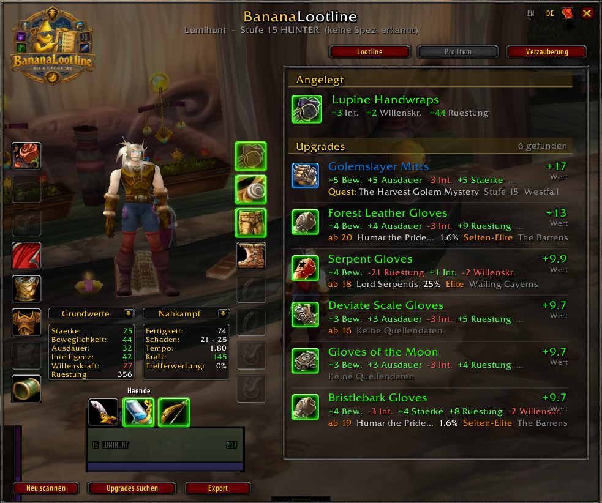
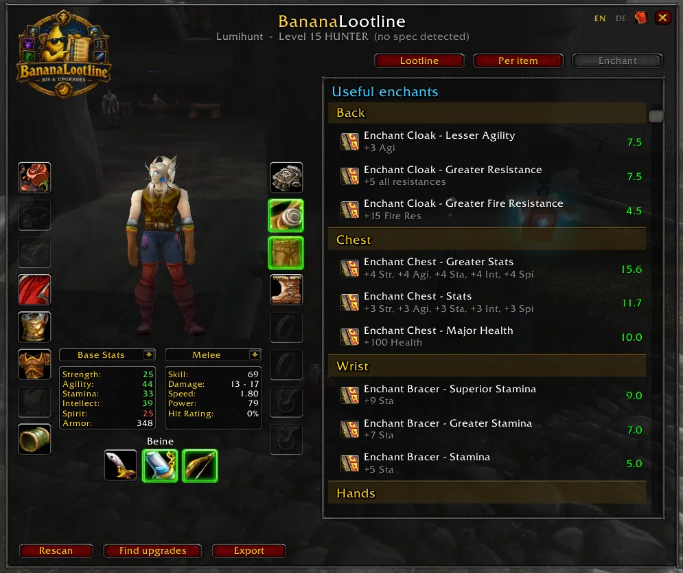
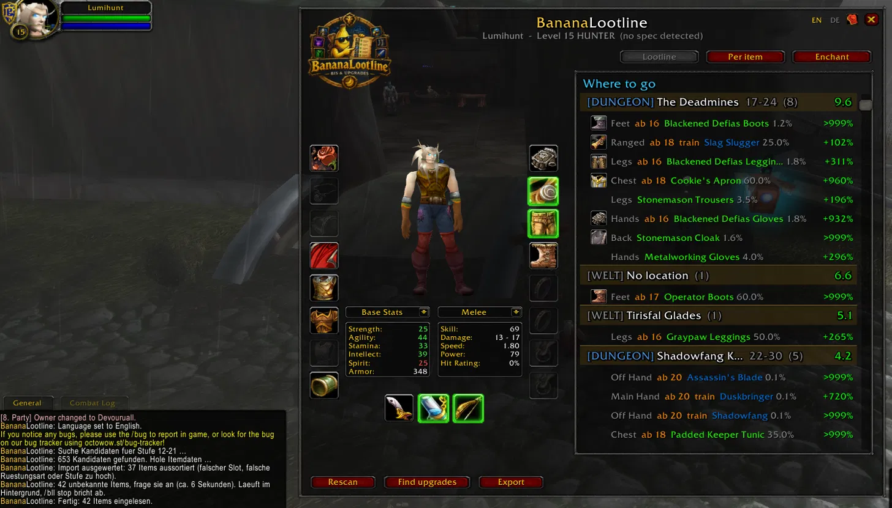

# 🍌 BananaLootline

**Gear and Loot planner for OctoWoW.** Answers two questions: *What's worth upgrading?* and *Where do I go?*

An addon for Vanilla 1.12 running *Mysteries of Azeroth*. Part of [BananaForge](https://github.com/BananaForge).

---

## 📸 Screenshots

| | |
|---|---|
|  |  |
| *Lootline — upgrades grouped by location* | *Per item — candidates for a single slot* |
|  |  |
| *Enchant — scored suggestions per slot* | *Where to go — locations ranked by yield* |

---

## 🎯 Server Data, Not Vanilla Data

This is the part that matters most, so it goes first.

Drop chances, mob levels, elite ranks, vendor prices, reputation requirements and quest rewards all come from **this server's own database**, exported and bundled with the addon. Not from a vanilla dataset that happens to be close enough.

The difference is not academic. pfQuest's vanilla figures name a level-60+ mob at 1.92% as the best source for *Feet of the Lynx* — an item you can wear at 19. The server knows three mobs at level 23–24, the best at 0.0045%. A level-15 hunter following the first number walks to a target he cannot reach, for an item that does not drop there.

**What's bundled:** 14,230 equippable items, 11,519 of them with a source, 6,941 named NPCs, 137 zones, 172 sets with their bonuses.

**Is pfQuest still required?** No. The addon runs fully without it, and it draws no map pins of its own — that is pfQuest's own window, working independently.

What pfQuest still adds when installed:

- **Localized names.** The bundled NPC and zone names are English. On a German client pfQuest supplies German ones.
- **A fallback for 2,346 equippable items** to which the server's export assigns no source at all. pfQuest names one from the vanilla dataset. Treat those with care — it is exactly the data this addon replaced everywhere else, and some of it describes content this server does not have. Rows from that fallback are marked `(pfQuest)` in `/bll src`.

Its geography was used once, at build time: the zone of every mob was resolved through pfQuest's coordinates and written into `Data/ZoneNames.lua`. At runtime nothing is looked up there.

<details>
<summary>Why the zone comes from pfQuest and not from the export</summary>

The export's zone field mixes two ID spaces. Outdoor zones carry the AreaTable ID, instances carry the Map ID, and the two overlap. ID 209 is Zul'Farrak as a Map ID and Shadowfang Keep as an AreaTable ID. Under 229 stand Blackhand mobs — Blackrock Spire — while pfQuest calls that ID "Olsen's Farthing". Verified against mob names for more than twenty IDs; there is no rule that separates the two cases.

So the importer resolves each mob's zone through pfQuest's coordinates, whose numbering is self-consistent, and writes the answer into the data file. Nothing is guessed at runtime.

Quests are the exception: they carry their own `category` field, which *is* unambiguous — 3456 Naxxramas, 3428 Ahn'Qiraj, 1977 Zul'Gurub. 96.7% of quest sources are located that way.
</details>

---

## ✨ Features

### 🔍 Automatic Equipment Scan
All 17 gear slots are scanned on login and on every equipment change. No manual entry needed.

### 📊 Stat Scoring
Stats come from the bundled data as numbers, not from parsed tooltip text. Attributes, resistances, armor, weapon damage and slot are structured; only secondary stats — attack power, hit, spell power — are read from effect sentences, against 21 English patterns. Scores are weighted by class and detected spec and compared to candidates in your level range.

### 🗺️ Lootline View
All upgrades grouped by location, sorted by total yield. Answers **where should I go?** instead of **which item is better for this slot?** Each group shows its category, level range and expected gain per visit — drop chance included, so a location with one 75% drop outranks one with three 1% drops.

### ⚔️ Elite and Rare Markers
*Forest Leather Gloves* drop at 1.6% — from Humar the Pridelord, a rare elite at level 23, and two more rares. As a bare percentage that reads like an ordinary drop and a level-15 hunter sets off alone. Elite, Rare Elite, Boss and Rare now sit next to the chance, in both the lootline and the per-item view.

### 📉 Honest Drop Chances
The median drop chance in the dataset is 0.0085%. Printed with one decimal that reads "0.0%", which looks like *never drops*. Decimal places now grow as the value shrinks: 33%, 1.6%, 0.016%, 0.0045%. Below 0.1% a source no longer drives the lootline — a 1-in-22,000 drop is not a destination — but it stays visible in the per-item view.

### 🔮 Quest Rewards
2,664 items come from quests, with quest level, faction and the number of choice rewards. pfQuest contains none of this; its `["Q"]` field does not appear in any items file. Quests are placed where they take place, not where the giver stands: *The Defias Brotherhood* starts in Westfall but ends in the Deadmines, and that is where you go for the item.

Quests above your reach are filtered out. A quest you cannot accept is not a source — and unlike a mob three levels above you, there is no group that fixes that.

### ⚖️ Faction Filtering
Opposite-faction sources — quests and vendors alike — are removed using the faction the server records. *Outrider's Bow* belongs to Kelm Hargunth, a Horde quartermaster in the Barrens; an Alliance character never sees it. The mapping is verified against the starting zones: Elwynn Forest has 25 Alliance quests and zero Horde, Durotar has 30 Horde and zero Alliance.

### 🔒 Reputation and Rank
411 items carry a reputation requirement from the server's own data — *Argent Dawn – Revered* and the like. They appear with the requirement in orange, so you see the target and what it costs. **PvP rank requirements: zero.** The "Warsong Gulch – Revered" line some players see on *Outrider's Bow* comes from AtlasLoot and does not apply to this server.

### 🏪 Vendor Toggle
Vendor goods are certain, so they score their full gain while a dungeon drop is multiplied by its chance. Unfiltered, the vendor always sits on top and crowds out every place you would actually travel to. A checkbox at the top right of the lootline turns them on when you want them.

### 🎲 Proc Effects Are Not Ignored
A proc effect written as a sentence scores zero points. Without a guard, Hand of Justice would lose to any piece with four Stamina. The bundled data flags all 629 items that carry one, so the addon knows rather than guesses. When your equipped item has an effect the addon cannot put a number on, a candidate has to lead clearly instead of narrowly, and such suggestions are marked as an incomplete comparison.

### ⚡ Use Effects
Active effects are scored proportionally: 100 Attack Power for 20 seconds on a 120-second cooldown counts as ~17, not 100. Adjust the assumed cooldown with `/bll usecd`.

### 🏆 Set Bonuses
A weaker individual piece can rank above a stronger one if it completes a set bonus. 253 of the 471 bonuses in the data are expressible as stats and are scored; the rest — "Reduces the cooldown of your Blink spell by 1.5 sec" — are shown but not converted into a number, because they cannot honestly be.

### 🖼️ Icons for Items You Don't Own
`GetItemInfo` only returns a texture for items the client has already seen — which excludes exactly the items you are planning for. They used to show a question mark. 14,081 of 14,230 items now carry their icon name in the data; the client is still asked first, the bundled name only fills the gap.

### 🎯 Spec Detection
Spec is read from `GetTalentTabInfo`. Weights shift accordingly. No spec is guessed below 10 talent points.

### 🛡️ Class & Armor Filtering
No staves for Hunters. No plate for Rogues. No two-handed axes for Mages. Armor type restrictions follow the 1.12 rules.

### 📍 Source Categories
Dungeon, Raid, World Boss, Battleground, Vendor, Quest, World. The location decides before the source type: the Deadmines are a dungeon whether you go there for a quest or for a drop. Level ranges are shown next to each location and turn orange if you cannot enter yet.

### 🔭 Forward Planning
`/bll ahead <n>` sets how many levels ahead the search reaches. Sources far above your level are dropped — the margin is generous enough to keep instances in, since a level-15 character does run the Deadmines with a group.

### 🔒 Content Phases
Instances that are not open on OctoWoW yet are left out. A level 57 was being sent to Naxxramas and Ahn'Qiraj — content that does not exist on the server, which the addon could not see because it judged reachability by mob level alone. The seven release dates come from [octowow.st/roadmap](https://octowow.st/roadmap) and the lock lifts itself on release day. `/bll phase` lists them; `/bll phase <no> on|off` overrides one by hand if the server differs.

### ✨ Enchant Recommendations
107 enchants from the OctoWoW database, scored with the same weights as gear. Scope suggestions cover Back, Chest, Wrist, Hands, Legs, Feet, Main Hand and Ranged.

### 🌐 Full Bilingual Interface
The DE/EN switch in the top right changes every text the addon produces — window labels, chat messages, help and progress output. Your choice is saved per account. Tooltip parsing always follows the game client's language, so switching the display never breaks stat detection.

### 💬 Tooltip Hook
Sources appear on every item tooltip in the game, not only inside the addon window.

---

## 📦 Installation

1. Download the latest ZIP from **[Releases](https://github.com/BananaForge/BananaLootline/releases/latest)** (the file `BananaLootline-x.y.z.zip`, not "Source code") and extract the `BananaLootline` folder into `<WoW directory>\Interface\AddOns\`. No renaming needed.
   (GitHub's green "Code → Download ZIP" button gives a folder called `BananaLootline-main` — that one has to be renamed to `BananaLootline`, or the game will not load it.)
2. Optional: install **pfQuest** and **pfQuest-octo**. They are not required — the addon has its own source data. They add localized NPC and zone names on a non-English client, a fallback for items the server's export does not cover, and their own map pins.
   → [pfQuest-octo by roby-brok](https://github.com/roby-brok/pfQuest-octo)
3. Log in and type `/bll`.

Settings from an earlier OctoLootline install are carried over automatically.

**Analytics note:** once per login, and when the guild dashboard BananaGuild asks for it, the addon invisibly reports its name and version to the guild (guild addon channel, prefix `BGLD`, via `BananaPresence.lua`). Nothing is shown in chat.

---

## 🎮 Commands

### Everyday use

| Command | Effect |
|---|---|
| `/bll` | Open / close the window |
| `/bll up [n]` | Search for upgrades, `n` overrides the span from `/bll ahead` for this run |
| `/bll ilvl <min-max>` | Only suggest items in this item level range (`off` removes it) |
| `/bll ahead <n>` | Levels the search reaches ahead (default 0 = equippable only) |
| `/bll lang de\|en\|auto` | Display language, including all status messages |
| `/bll spec` | Show detected spec and talent points per tree |
| `/bll weight` | Show or set stat weights, `reset` restores the defaults |
| `/bll usecd <s>` | Assumed cooldown for use effects |
| `/bll stop` | Cancel a running scan |

### Looking things up

| Command | Effect |
|---|---|
| `/bll src <itemID>` | Sources of an item: mob, level, elite rank, chance, zone, vendor price |
| `/bll set <itemID>` | Set membership and bonuses |
| `/bll item <itemID>` | The cached entry of an item, including any detected restriction |
| `/bll info` | Status line — version, data loaded, pfQuest present, locale, phases |
| `/bll phase` | List the seven content phases with dates and state |
| `/bll phase <no> on\|off\|auto` | Open or close a phase by hand, `auto` follows the date again |

### When something looks wrong

| Command | Effect |
|---|---|
| `/bll selftest` | Checks patterns against your actual gear, language match, data state, tooltip completeness. Output is meant to be pasted into a bug report |
| `/bll dump <itemID>` | Raw tooltip lines, what was parsed, and which effect lines could not be scored |
| `/bll tip <itemID>` | Reads one item four different ways and shows which returns complete lines |
| `/bll hooks` | Lists addons that may be extending tooltips |
| `/bll debug` | Toggle verbose output |

### Adjusting the addon's view of the world

| Command | Effect |
|---|---|
| `/bll cat <Zone> <Category>` | Reassign a location (dungeon, raid, worldboss, vendor, object …) |
| `/bll unused` | Toggle display of unreachable sources |
| `/bll locked` | Toggle items needing reputation or rank |
| `/bll rate <n>` | Scan rate in items/second (default 8) |
| `/bll forget` | Clear the item cache |
| `/bll scan` | Rescan equipment and print to chat |

---

## ⚠️ Known Gaps

Measured against the bundled data, not guessed.

**2,711 equippable items have no source at all.** Not a bug in the addon — the server's database lists no mob, vendor, quest or recipe for them. They appear in the per-item view and are left out of the lootline, because a route to them cannot be planned.

**521 items have mob sources that pfQuest cannot place.** Their drop data is correct, their location is unknown, so they do not appear in the lootline. Closing this needs the zone name from the export itself rather than the ambiguous ID.

**25 items have neither an item level nor a level requirement but do carry stats.** The fallback estimate computes 0 for them, so they enter every pool from level 1. Two are epics. Whether the database genuinely holds no item level for them is unverified.

**149 equippable items carry no icon** and still show a question mark. Most are test content.

**218 of 471 set bonuses cannot be scored** — cooldown reductions, movement speed, ability-specific effects. They are shown, never silently converted into a number.

**25 quests carry an unset faction flag** and count as available to both sides. That is 0.9% of all quests; two of them are in Durotar and clearly Horde.

**Stat weights in `Weights.lua` are placeholders.** They separate "clearly better" from "clearly worse" but are not proper theorycraft. Use `/bll weight` to experiment.

**Use effect cooldowns are estimated,** not read from the data. `/bll usecd` sets the assumption.

**31 weapons have DPS but no damage range** (elemental damage only).

---

## 🏗️ Architecture

```
BananaLootline.toc
Locale.lua              UI strings + tooltip patterns (deDE / enUS)
Data/ItemData.lua       Generated — items, stats, icons, proc flags, restrictions
Data/SourceData.lua     Generated — up to 3 best sources per item and kind
Data/NpcData.lua        Generated — names of mobs, vendors and quest givers
Data/ZoneNames.lua      Generated — zone names for the IDs in SourceData
Data/SetData.lua        Generated — sets and their bonuses
Data/ZoneData.lua       Instance metadata: category, level range, minimum level
Data/EnchantData.lua    Enchants per slot
ItemDB.lua              Access layer for ItemData, icon paths
SetDB.lua               Access layer for SetData
EnchantDB.lua           Enchant scoring
Weights.lua             Stat weights, use effects, scoring
Core.lua                Init, events, slash commands
Scanner.lua             Tooltip scan → stat table
Sources.lua             Source lookup (bundled data first, pfQuest for the map)
Gear.lua                Equipment and bag scan
Candidates.lua          Candidate search, upgrade calculation, lootline grouping
UI.lua                  Main window
tools/octo_import.py    Converts the OctoWoW export into the Data/ files
tools/run_tests.sh      All tests; must print ALLE TESTS OK
```

### Rebuilding the data

```bash
python3 tools/octo_import.py <export directory> --out BananaLootline \
  --zones   <pfQuest enUS/zones.lua> \
  --units   <pfQuest enUS/units.lua> \
  --coords  <pfQuest units.lua> \
  --quests  <pfQuest quests.lua> \
  --objects <pfQuest objects.lua>
```

The quest chains in `Data/QuestData.lua` come from pfQuest as well, built after the importer above:

```bash
lua5.1 tools/quest_import.lua <pfQuest> <pfQuest-turtle> <pfQuest-octo>
```

Each option can be given several times; later files override earlier ones, so pass the server-specific package last. The data in this repository is built from [pfQuest](https://github.com/shagu/pfQuest), [pfQuest-turtle](https://github.com/shagu/pfQuest-turtle) and [pfQuest-octo](https://github.com/paokkerkir/pfQuest-octo), in that order. NPCs that pfQuest cannot place get their zone from the export's location number, calibrated against the NPCs pfQuest does know (see `vote_locations` in the importer). The run takes about 13 seconds over the 736 MB export and reduces 2.1 million drop rows to roughly 25,000 source rows by keeping the three best sources per item and kind.

---

## 🧪 Real-World Testing Needed — Help Wanted!

### This addon needs feedback from actual players.

My test character is **level 15** and only covers Hunter. I have no real-world data on how the scoring, source detection, and upgrade suggestions hold up for other classes, specs, or higher level ranges.

### What I need from you:

- Does the scoring make sense for your class and level?
- Are the source locations correct? Are drop chances plausible?
- Do elite and rare markers match what you actually find there?
- Are enchant suggestions reasonable for your gear level?
- Does anything break at higher levels (30+, 40+, 50+)?
- Are there upgrade candidates missing that you'd expect to see?

### How to report:

The best bug reports include a **screenshot** showing what you saw and what you expected, plus the output of `/bll selftest`. Open a GitHub Issue here.

**Helpful debugging commands:**

```
/bll selftest    — patterns, language, data state, tooltip completeness
/bll src <id>    — where the addon thinks an item comes from
/bll dump <id>   — raw tooltip lines for an item
/bll info        — addon version and data state
/bll phase       — which content phases are open
```

Every piece of feedback improves the addon for everyone. You genuinely matter.

---

## 📝 Credits

Item, stat and source data from the [OctoWoW database](https://octowow.st/db) (AoWoW-based), exported and converted by `tools/octo_import.py`.

Zone names from **pfQuest** and its data packages:
Eric Mauser (Shagu), The Kludge Bureau, paokkerkir — combined in [pfQuest-octo](https://github.com/roby-brok/pfQuest-octo) by Roby_Brok. MIT-licensed. The zone names in `Data/ZoneNames.lua` are derived from those packages at build time; nothing else is redistributed. When pfQuest is installed, the addon also reads localized names and fallback sources from `pfDB` at runtime.

Logo: `Images/BananaForge.tga` — 128×128 uncompressed TGA (required by the 1.12 client).

---

*BananaLootline is part of [BananaForge](https://github.com/BananaForge) — addon tools for OctoWoW.*
